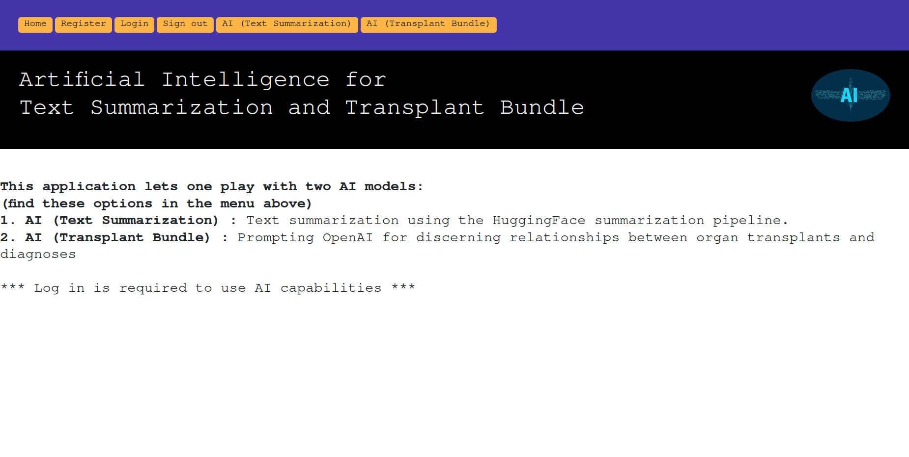
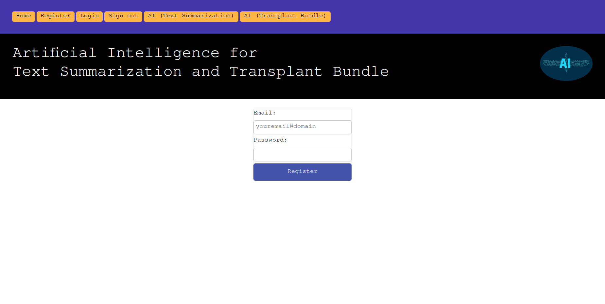
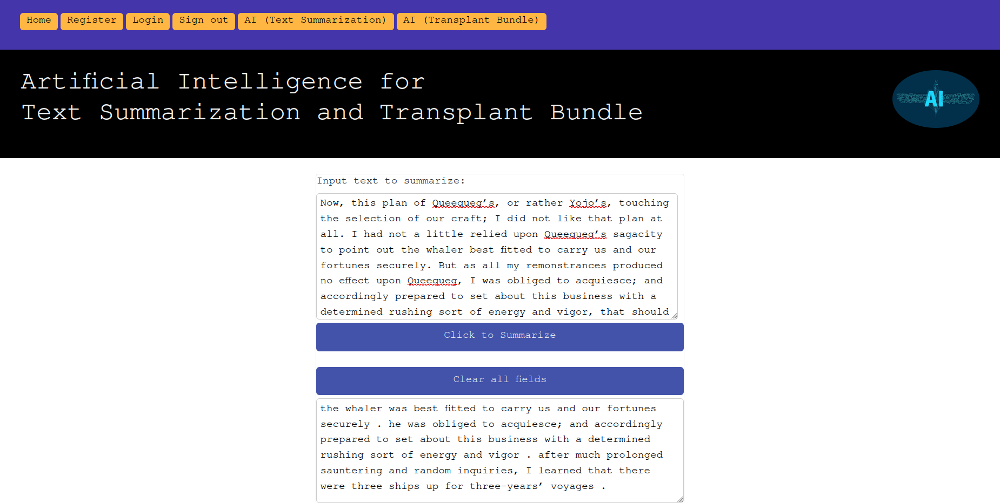
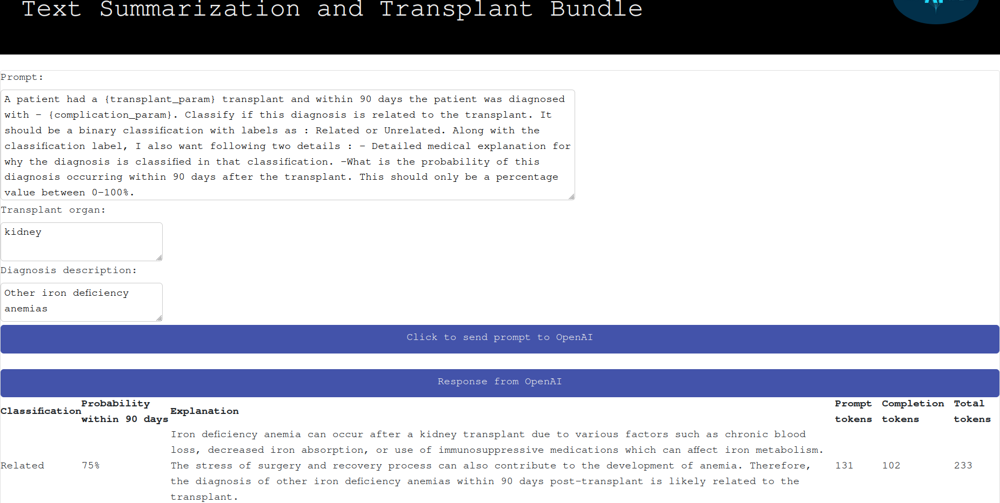

# AI - Web Application for Text Summarization and Transplant Bundle

***

## Description :-

This project is just a start - it's web application which helps one play with two AI models. 

1. AI (Text Summarization) : Text summarization using the HuggingFace summarization pipelie.   
2. AI (Transplant Bundle) : Prompting OpenAI for discerning relationships between organ transplants and diagnoses.

More layers and functionality will be gradually added to this web application. 

* Backend - Built using the <a href="https://fastapi.tiangolo.com/">FastAPI framework</a>.
* Authentication - Done using <a href="https://fastapi.tiangolo.com/tutorial/security/simple-oauth2/">OAuth2</a>.
* Frontend - Built using the <a href="https://react.dev/">React framework.</a>
* Database - To start with this, this is a sqlite single file database.
* Database migrations - Done with <a href="https://alembic.sqlalchemy.org/en/latest/">Alembic</a>.
* Interaction with Database - Done with <a href="https://sqlmodel.tiangolo.com/">SQLModel</a>
* Configuration and Building - Done using the make utility. 

***

## Setup :-

### (1) Create a virtual environment :- (skip if one of interest already exists)

```commandline
cd ~/
mkdir  my_dir_for_venvs
cd my_dir_for_virtual_envs
python3 -m venv my-venv
```

### (2) Activate the virtual environment :-
```commandline
source ~/my_dir_for_venvs/my-venv/bin/activate

### (3) Clone this repository :-
```commandline
cd ~/
git clone https://github.com/nsb700/ai_summarizer_and_transplant_bundle.git ai_app
```

### (4) Install all required dependencies and start Uvicorn for the backend application (on port 8000) :-
```commandline
cd ~/ai_app
make all
```

### (5) Now open a separate terminal and run the following. This will start the frontend application (on port 3000) :

```commandline
source ~/my_dir_for_venvs/my-venv/bin/activate
cd ~/ai_app
make startreact
```

### (6) In the browser, go to http://localhost:3000

### (7) Few screenshots :










